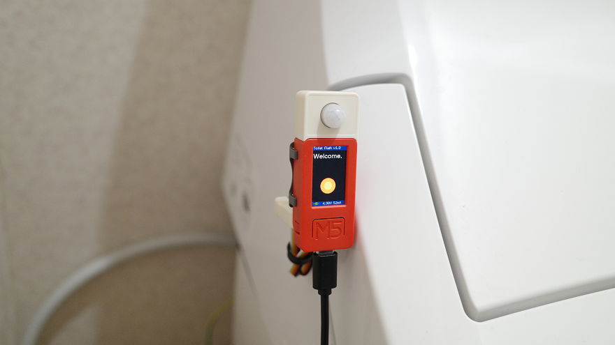
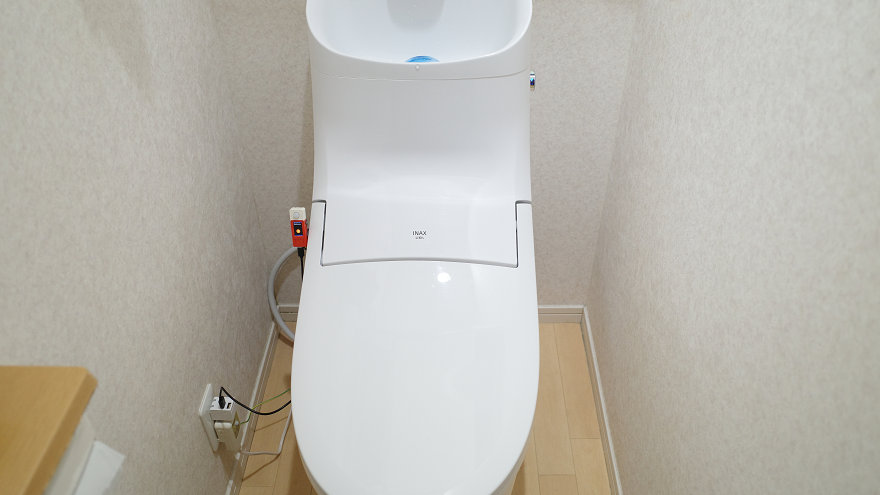

# Toilet flush

## 概要
配管上の問題でトイレ詰まりをよく起こすトイレにおいて、使用後に詰まり防止目的で流すため、離席後一定時間たったら（離席時に流すが、タンクに水がたまるのを待つ）、再度タイマーでトイレを流す（大）。

## 対象機材（トイレ）
* リモコンで流す動作可能なシャワートイレ (プレアス DT-CL114A・CH184A用リモコンで確認)  
  (リモコンのコマンドが異なる場合、赤外線コマンド学習モードで解析する必要があります。)

## 必要機材（このプログラムを動作させるのに使用する機材）
* M5StickC Plus
* M5Stack用赤外線送受信ユニット [U002] (必須ではないが使用を推奨、送信コマンドを赤外線センサで解析する必要がある場合は必要・本体の赤外線LEDからのコマンドが弱くて使えない場合も必要)
* M5StickC PIR Hat（必須ではない。使用した場合は、接近するとディスプレイをONにできる)
* M5StickC ToF Hat（必須ではない。使用した場合は、Aボタンの代わりに距離センサーで操作可能)

## 機能
### 基本動作
1. 着座を待つ。
2. 着座後、指定時間(デフォルト:60秒)経過したら離席待ちとする。経過せずに離席した場合は1へ戻る。
3. 離席後、カウントダウンして指定時間(デフォルト:120秒)たったらトイレを流す。 
4. 設定に応じて２回目のカウントダウンを行い、指定時間たったらトイレを流す。
5. 離席後、カウントダウン中に再度着座したら、2の離席待ちに戻る。
### 手動操作
5. Aボタン(M5ボタン)を1回押すとディスプレイ点灯。もう一度押すと手動のカウントダウン開始。カウントダウン中に再度押すと1の着座待ちに戻る（ディスプレイ消灯）。
6. Bボタン(向かって右)を押すとメニューに遷移。メニュー中はAボタンで項目選択、Bボタンで次のメニューへ（またはメニュー終了）
### 赤外線コマンド学習モード
7. Aボタンを押しながら起動(またはリセット)で赤外線コマンド学習モードを起動(リモコンから赤外線センサーにコマンドを送って記憶させる。Aボタンで送信テスト・Bボタンで保存)
### 全設定クリア
8. Bボタンを押しながら起動(またはリセット)で全設定クリア(赤外線コマンド含む)

## 設置
* トイレのふたが閉じた状態でディスプレイが前・USB Type-Cのコネクタが下を向くように、ふたを開けるとディスプレイが上を向くように、トイレのふたの横に両面テープ等で張り付ける。  
  (45°で着座/離席を判定するが、蓋を閉じた状態で70°以上、垂直に近い状態での使用を推奨)
* M5Stack用赤外線送受信ユニットはM5StickC Plusの裏やトイレに赤外線を送信できる位置に両面テープなどで固定。

取付例

